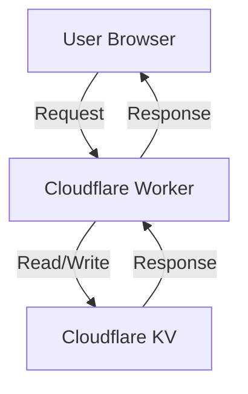

# AI-First Implementation Plan: Car VIN Collection & Storage

## Overview

**Goal**: Collect VIN data from car pages, store it in **Cloudflare KV**, and display it to subsequent users on the same page.

**Key Requirements**:
- Authorization via **IP + User-Agent**
- Unique key per car page (ID from URL, e.g., `131905951` from `https://cars.av.by/bmw/7-seriya/131905951`)
- Rate limiting for **both read and write** operations
- **Permanent data storage** with confirmation counts
- **User data stored as unique hashes** (no personal data)
- **Only VIN is stored** (no phone numbers)

---

## Architecture

### Components



### Data Flow

1. **User visits car page** (e.g., `https://cars.av.by/bmw/7-seriya/131905951`)
2. **Browser checks local storage** for existing VIN
3. **If no VIN**: User clicks button → Browser extracts VIN from page → Sends to Worker
4. **Worker**:
   - Validates request (IP + User-Agent)
   - Applies rate limiting
   - Validates VIN format
   - Stores/updates data in **Cloudflare KV**
5. **Worker returns VIN data** to browser
6. **Browser caches VIN** for future visits

---

## Technical Stack

| Component          | Technology          | Purpose                          |
|--------------------|---------------------|----------------------------------|
| Edge Function      | Cloudflare Workers  | Handle requests, validate, rate limit |
| Storage            | **Cloudflare KV**   | Store VIN data permanently        |
| Authentication     | IP + User-Agent     | Identify users (hashed)           |
| Rate Limiting      | Cloudflare KV       | Prevent abuse                    |

---

## Data Model

### KV Key Structure

| Key Type               | Format                          | Example                          | TTL       |
|------------------------|---------------------------------|----------------------------------|-----------|
| Car VIN Data           | `vin:{pageId}`                  | `vin:131905951`                  | Permanent |
| User Hashes            | `user:{hashedIdentifier}`       | `user:sha256_ip_ua`              | Permanent |
| Rate Limit (Write)     | `rl:w:{ip}:{pageId}`            | `rl:w:1.2.3.4:131905951`         | 60s       |
| Rate Limit (Read)      | `rl:r:{ip}:{pageId}`            | `rl:r:1.2.3.4:131905951`         | 60s       |

### Stored Data Structure

#### VIN Data (`vin:{pageId}`)
```json
{
  "vin": "WBA1A5C50JF123456",
  "pageUrl": "https://cars.av.by/bmw/7-seriya/131905951",
  "pageId": "131905951",
  "createdAt": 1712345678,
  "updatedAt": 1712345678,
  "confirmations": 3,
  "confirmedBy": [
    "sha256:abc123...",
    "sha256:def456...",
    "sha256:ghi789..."
  ],
  "submittedBy": [
    "sha256:abc123...",
    "sha256:def456..."
  ]
}
```

#### User Hashes (`user:{hashedIdentifier}`)
```json
{
  "hashedId": "sha256:abc123...",
  "createdAt": 1712345678,
  "submissions": ["131905951", "131905952"],
  "confirmations": ["131905951", "131905953"]
}
```

---

## Implementation Phases

### Phase 1: Setup & Configuration (1 day)

#### 1.1 Create Cloudflare KV Namespace
- [ ] Go to Cloudflare Dashboard → Workers → KV
- [ ] Click **"Create a namespace"**
- [ ] Name: `CAR_VIN_DATA`
- [ ] Bind to Worker later

#### 1.2 Create Cloudflare Worker
- [ ] Go to Cloudflare Dashboard → Workers → Manage Workers
- [ ] Click **"Create a Worker"**
- [ ] Name: `car-vin-collector`
- [ ] Select **"Service"** (not Page)

#### 1.3 Configure Worker Settings
- [ ] Add KV namespace binding:
  ```javascript
  // In wrangler.toml or Worker settings
  kv_namespaces = [
    { binding = "VIN_DATA", id = "<namespace-id>" }
  ]
  ```
- [ ] Set environment variables (optional, for rate limits):
  ```bash
  RATE_LIMIT_WRITE=10  # requests per minute per IP per page
  RATE_LIMIT_READ=30   # requests per minute per IP per page
  ```
- [ ] Set route: `api.cars.av.by/*` or custom domain

---

### Phase 2: Core Functionality (2-3 days)

#### 2.1 Utility Functions

**File**: `src/utils.ts`

```typescript
// Hash user identifier (IP + User-Agent)
export async function hashUserIdentifier(ip: string, userAgent: string): Promise<string> {
  const identifier = `${ip}:${userAgent}`;
  const buffer = await crypto.subtle.digest('SHA-256', new TextEncoder().encode(identifier));
  return Array.from(new Uint8Array(buffer)).map(b => b.toString(16).padStart(2, '0')).join('');
}

// Extract page ID from URL
export function extractPageId(url: string): string | null {
  const match = url.match(/\/(\d+)(?:\/|$)/);
  return match ? match[1] : null;
}

// Validate VIN (17 characters, no I, O, Q)
export function validateVIN(vin: string): boolean {
  const cleanVin = vin.toUpperCase().replace(/[^A-HJ-NPR-Z0-9]/g, '');
  return /^[A-HJ-NPR-Z0-9]{17}$/.test(cleanVin);
}

// Generate unique hash for user data per page
export async function hashUserData(ip: string, userAgent: string, pageId: string): Promise<string> {
  const data = `${ip}:${userAgent}:${pageId}`;
  const buffer = await crypto.subtle.digest('SHA-256', new TextEncoder().encode(data));
  return Array.from(new Uint8Array(buffer)).map(b => b.toString(16).padStart(2, '0')).join('');
}
```

#### 2.2 KV Helper Functions

**File**: `src/kv.ts`

```typescript
// Types
export interface VINData {
  vin: string;
  pageUrl: string;
  pageId: string;
  createdAt: number;
  updatedAt: number;
  confirmations: number;
  confirmedBy: string[];
  submittedBy: string[];
}

export interface UserData {
  hashedId: string;
  createdAt: number;
  submissions: string[];
  confirmations: string[];
}

// Get VIN data for a car page
export async function getVINData(env: Env, pageId: string): Promise<VINData | null> {
  const data = await env.VIN_DATA.get(`vin:${pageId}`, { type: 'json' });
  return data || null;
}

// Set VIN data for a car page
export async function setVINData(env: Env, pageId: string, data: VINData): Promise<void> {
  await env.VIN_DATA.put(`vin:${pageId}`, JSON.stringify(data));
}

// Update VIN data for a car page
export async function updateVINData(env: Env, pageId: string, updates: Partial<VINData>): Promise<void> {
  const existing = await getVINData(env, pageId);
  if (!existing) throw new Error('VIN data not found');
  await env.VIN_DATA.put(`vin:${pageId}`, JSON.stringify({ 
    ...existing, 
    ...updates, 
    updatedAt: Date.now() 
  }));
}

// Get user data
export async function getUserData(env: Env, hashedId: string): Promise<UserData | null> {
  const data = await env.VIN_DATA.get(`user:${hashedId}`, { type: 'json' });
  return data || null;
}

// Set user data
export async function setUserData(env: Env, hashedId: string, data: UserData): Promise<void> {
  await env.VIN_DATA.put(`user:${hashedId}`, JSON.stringify(data));
}

// Add submission to user
export async function addUserSubmission(env: Env, hashedId: string, pageId: string): Promise<void> {
  const userData = await getUserData(env, hashedId) || {
    hashedId,
    createdAt: Date.now(),
    submissions: [],
    confirmations: []
  };
  if (!userData.submissions.includes(pageId)) {
    userData.submissions.push(pageId);
    await setUserData(env, hashedId, userData);
  }
}

// Add confirmation to user
export async function addUserConfirmation(env: Env, hashedId: string, pageId: string): Promise<void> {
  const userData = await getUserData(env, hashedId) || {
    hashedId,
    createdAt: Date.now(),
    submissions: [],
    confirmations: []
  };
  if (!userData.confirmations.includes(pageId)) {
    userData.confirmations.push(pageId);
    await setUserData(env, hashedId, userData);
  }
}
```

#### 2.3 Rate Limiting with KV

**File**: `src/rateLimiter.ts`

```typescript
const WRITE_LIMIT = parseInt(process.env.RATE_LIMIT_WRITE || '10');
const READ_LIMIT = parseInt(process.env.RATE_LIMIT_READ || '30');
const WINDOW_SECONDS = 60;

// Check write rate limit
export async function checkWriteLimit(env: Env, ip: string, pageId: string): Promise<boolean> {
  const key = `rl:w:${ip}:${pageId}`;
  const current = await env.VIN_DATA.get(key);
  const count = current ? parseInt(current) + 1 : 1;
  
  await env.VIN_DATA.put(key, count.toString(), { expirationTtl: WINDOW_SECONDS });
  
  return count <= WRITE_LIMIT;
}

// Check read rate limit
export async function checkReadLimit(env: Env, ip: string, pageId: string): Promise<boolean> {
  const key = `rl:r:${ip}:${pageId}`;
  const current = await env.VIN_DATA.get(key);
  const count = current ? parseInt(current) + 1 : 1;
  
  await env.VIN_DATA.put(key, count.toString(), { expirationTtl: WINDOW_SECONDS });
  
  return count <= READ_LIMIT;
}
```

#### 2.4 Main Worker Logic

**File**: `src/index.ts`

```typescript
import { 
  getVINData, 
  setVINData, 
  updateVINData, 
  addUserSubmission, 
  addUserConfirmation 
} from './kv';
import { checkWriteLimit, checkReadLimit } from './rateLimiter';
import { 
  extractPageId, 
  validateVIN, 
  hashUserIdentifier, 
  hashUserData 
} from './utils';

interface Env {
  VIN_DATA: KVNamespace;
}

export default {
  async fetch(request: Request, env: Env): Promise<Response> {
    const url = new URL(request.url);
    const path = url.pathname;
    const method = request.method;
    
    // Extract IP and User-Agent
    const ip = request.headers.get('CF-Connecting-IP') || '';
    const userAgent = request.headers.get('User-Agent') || '';
    
    try {
      // Handle GET request (read VIN data)
      if (method === 'GET' && path.startsWith('/api/vin/')) {
        const pageId = extractPageId(path);
        if (!pageId) {
          return new Response(JSON.stringify({ error: 'Invalid page ID' }), { 
            status: 400,
            headers: { 'Content-Type': 'application/json' }
          });
        }
        
        // Check read rate limit
        const readAllowed = await checkReadLimit(env, ip, pageId);
        if (!readAllowed) {
          return new Response(JSON.stringify({ error: 'Read rate limit exceeded' }), { 
            status: 429,
            headers: { 'Content-Type': 'application/json' }
          });
        }
        
        // Get VIN data
        const vinData = await getVINData(env, pageId);
        
        if (!vinData) {
          return new Response(JSON.stringify({ exists: false }), { 
            status: 200,
            headers: { 'Content-Type': 'application/json' }
          });
        }
        
        // Add user to confirmedBy if not already there
        const userDataHash = await hashUserData(ip, userAgent, pageId);
        if (!vinData.confirmedBy.includes(userDataHash)) {
          await updateVINData(env, pageId, {
            confirmations: vinData.confirmations + 1,
            confirmedBy: [...vinData.confirmedBy, userDataHash],
          });
          const userIdHash = await hashUserIdentifier(ip, userAgent);
          await addUserConfirmation(env, userIdHash, pageId);
        }
        
        return new Response(JSON.stringify(vinData), { 
          status: 200,
          headers: { 'Content-Type': 'application/json' }
        });
      }
      
      // Handle POST request (submit VIN)
      if (method === 'POST' && path === '/api/vin') {
        const body = await request.json();
        const { vin, pageUrl } = body;
        
        // Validate inputs
        if (!vin || !pageUrl) {
          return new Response(JSON.stringify({ error: 'Missing required fields: vin and pageUrl' }), { 
            status: 400,
            headers: { 'Content-Type': 'application/json' }
          });
        }
        
        if (!validateVIN(vin)) {
          return new Response(JSON.stringify({ error: 'Invalid VIN format. Must be 17 characters (A-H, J-N, P, R-Z, 0-9)' }), { 
            status: 400,
            headers: { 'Content-Type': 'application/json' }
          });
        }
        
        const pageId = extractPageId(pageUrl);
        if (!pageId) {
          return new Response(JSON.stringify({ error: 'Invalid page URL. Must contain numeric ID' }), { 
            status: 400,
            headers: { 'Content-Type': 'application/json' }
          });
        }
        
        // Check write rate limit
        const writeAllowed = await checkWriteLimit(env, ip, pageId);
        if (!writeAllowed) {
          return new Response(JSON.stringify({ error: 'Write rate limit exceeded' }), { 
            status: 429,
            headers: { 'Content-Type': 'application/json' }
          });
        }
        
        // Generate user data hash
        const userDataHash = await hashUserData(ip, userAgent, pageId);
        const userIdHash = await hashUserIdentifier(ip, userAgent);
        
        // Get existing data or create new
        const existingData = await getVINData(env, pageId);
        
        if (existingData) {
          // Check if this user already submitted
          if (existingData.submittedBy.includes(userDataHash)) {
            return new Response(JSON.stringify({ 
              error: 'You already submitted VIN for this car',
              data: existingData 
            }), { 
              status: 200,
              headers: { 'Content-Type': 'application/json' }
            });
          }
          
          // Update existing data (only if VIN matches)
          if (existingData.vin === vin.toUpperCase().replace(/[^A-HJ-NPR-Z0-9]/g, '')) {
            await updateVINData(env, pageId, {
              submittedBy: [...existingData.submittedBy, userDataHash],
            });
          } else {
            return new Response(JSON.stringify({ 
              error: 'VIN does not match existing data for this car',
              existing: existingData 
            }), { 
              status: 409,
              headers: { 'Content-Type': 'application/json' }
            });
          }
        } else {
          // Create new entry
          const newData = {
            vin: vin.toUpperCase().replace(/[^A-HJ-NPR-Z0-9]/g, ''),
            pageUrl,
            pageId,
            createdAt: Date.now(),
            updatedAt: Date.now(),
            confirmations: 1,
            confirmedBy: [userDataHash],
            submittedBy: [userDataHash],
          };
          await setVINData(env, pageId, newData);
          await addUserSubmission(env, userIdHash, pageId);
        }
        
        // Return updated data
        const updatedData = await getVINData(env, pageId);
        return new Response(JSON.stringify(updatedData), { 
          status: 200,
          headers: { 'Content-Type': 'application/json' }
        });
      }
      
      // Handle OPTIONS for CORS
      if (method === 'OPTIONS') {
        return new Response(null, {
          status: 204,
          headers: {
            'Access-Control-Allow-Origin': '*',
            'Access-Control-Allow-Methods': 'GET, POST, OPTIONS',
            'Access-Control-Allow-Headers': 'Content-Type',
          },
        });
      }
      
      return new Response(JSON.stringify({ error: 'Not found' }), { 
        status: 404,
        headers: { 'Content-Type': 'application/json' }
      });
    } catch (error) {
      console.error('Error:', error);
      return new Response(JSON.stringify({ error: 'Internal server error' }), { 
        status: 500,
        headers: { 'Content-Type': 'application/json' }
      });
    }
  },
};
```

---

### Phase 3: Client-Side Integration (1-2 days)

#### 3.1 Browser Script

**File**: `public/car-vin-client.js`

```javascript
class CarVINClient {
  constructor(options = {}) {
    this.apiUrl = options.apiUrl || 'https://api.cars.av.by';
    this.storageKey = 'carVINCache';
    this.cache = this.loadCache();
  }

  loadCache() {
    try {
      return JSON.parse(localStorage.getItem(this.storageKey)) || {};
    } catch {
      return {};
    }
  }

  saveCache() {
    localStorage.setItem(this.storageKey, JSON.stringify(this.cache));
  }

  async getVINData(pageId) {
    // Check cache first
    if (this.cache[pageId]) {
      return this.cache[pageId];
    }

    // Fetch from API
    try {
      const response = await fetch(`${this.apiUrl}/api/vin/${pageId}`);
      const data = await response.json();
      
      if (data.exists === false) {
        return null;
      }

      // Update cache
      this.cache[pageId] = data;
      this.saveCache();
      
      return data;
    } catch (error) {
      console.error('Error fetching VIN data:', error);
      return null;
    }
  }

  async submitVIN(vin, pageUrl) {
    try {
      const response = await fetch(`${this.apiUrl}/api/vin`, {
        method: 'POST',
        headers: {
          'Content-Type': 'application/json',
        },
        body: JSON.stringify({ vin, pageUrl }),
      });
      
      const data = await response.json();
      
      if (response.ok) {
        // Update cache
        const pageId = this.extractPageId(pageUrl);
        if (pageId) {
          this.cache[pageId] = data;
          this.saveCache();
        }
      }
      
      return { success: response.ok, data };
    } catch (error) {
      console.error('Error submitting VIN:', error);
      return { success: false, error: error.message };
    }
  }

  extractPageId(url) {
    const match = url.match(/\/(\d+)(?:\/|$)/);
    return match ? match[1] : null;
  }

  async checkAndDisplayVIN(pageUrl) {
    const pageId = this.extractPageId(pageUrl);
    if (!pageId) return null;

    const data = await this.getVINData(pageId);
    return data;
  }
}

// Usage example:
// const client = new CarVINClient({ apiUrl: 'https://your-worker-url.workers.dev' });
// const data = await client.checkAndDisplayVIN(window.location.href);
// if (data) {
//   console.log('Found VIN:', data.vin);
// } else {
//   // Show button to submit
// }
```

#### 3.2 HTML Integration

```html
<!DOCTYPE html>
<html>
<head>
  <script src="car-vin-client.js"></script>
  <style>
    #vin-container {
      margin: 10px 0;
      padding: 10px;
      border: 1px solid #ddd;
      border-radius: 5px;
      background: #f9f9f9;
    }
    #vin-display {
      font-family: monospace;
      font-size: 16px;
      color: #333;
    }
    #submit-vin-btn {
      padding: 8px 16px;
      background: #4CAF50;
      color: white;
      border: none;
      border-radius: 4px;
      cursor: pointer;
    }
    #submit-vin-btn:hover {
      background: #45a049;
    }
    .confirmation-count {
      font-size: 12px;
      color: #666;
    }
  </style>
</head>
<body>
  <div id="vin-container">
    <div id="vin-display"></div>
    <button id="submit-vin-btn" style="display: none;">Show VIN</button>
  </div>

  <script>
    const client = new CarVINClient({ 
      apiUrl: 'https://your-worker-url.workers.dev' 
    });

    const pageUrl = window.location.href;
    const submitBtn = document.getElementById('submit-vin-btn');
    const displayDiv = document.getElementById('vin-display');

    // Check for existing VIN data
    client.checkAndDisplayVIN(pageUrl).then(data => {
      if (data) {
        displayVIN(data);
      } else {
        submitBtn.style.display = 'block';
      }
    });

    submitBtn.addEventListener('click', async () => {
      // Extract VIN from page (adjust selector as needed)
      const vinElement = document.querySelector('.vin-code, [data-vin], .vehicle-vin');
      let vin = vinElement ? vinElement.textContent.trim() : '';
      
      // Try alternative selectors if VIN not found
      if (!vin) {
        const vinInput = document.querySelector('input[name="vin"], input[id="vin"]');
        vin = vinInput ? vinInput.value.trim() : '';
      }

      if (!vin) {
        alert('Could not find VIN on this page. Please check the page source.');
        return;
      }

      // Clean VIN (remove spaces, dashes, etc.)
      vin = vin.replace(/[^A-HJ-NPR-Z0-9]/gi, '').toUpperCase();
      
      if (!vin || vin.length !== 17) {
        alert('Invalid VIN format. Must be 17 characters.');
        return;
      }

      const result = await client.submitVIN(vin, pageUrl);
      if (result.success) {
        displayVIN(result.data);
        submitBtn.style.display = 'none';
      } else {
        alert('Error submitting VIN: ' + (result.error || 'Unknown error'));
      }
    });

    function displayVIN(data) {
      displayDiv.innerHTML = `
        <div>
          <strong>VIN:</strong> <span style="font-family: monospace;">${data.vin}</span>
          <div class="confirmation-count">
            Confirmed by ${data.confirmations} user${data.confirmations !== 1 ? 's' : ''}
          </div>
        </div>
      `;
    }
  </script>
</body>
</html>
```

---

## Security Considerations

### 1. Input Validation
- [x] **VIN only** (no phone numbers stored)
- [x] VIN format validation (17 chars, A-H, J-N, P, R-Z, 0-9)
- [x] URL validation (must contain numeric page ID)

### 2. Rate Limiting
- [x] Write: **10 requests/minute/IP/page**
- [x] Read: **30 requests/minute/IP/page**
- [x] Uses Cloudflare KV for rate limiting (TTL: 60s)

### 3. Data Integrity
- [x] User identification via **IP + User-Agent** (SHA-256 hashed)
- [x] Unique user data hashes per submission (`ip:userAgent:pageId`)
- [x] Confirmation tracking to prevent spam
- [x] Each user can submit **only once per car**

### 4. Privacy
- [x] **No personal data stored** (only hashes)
- [x] IP addresses are **hashed**, not stored directly
- [x] User-Agent is **hashed**, not stored directly
- [x] **No phone numbers** collected or stored

### 5. Abuse Prevention
- [x] VIN must match for updates (prevents VIN tampering)
- [x] First VIN is kept (prevents VIN spam)
- [x] Each user can submit only once per car page
- [x] Rate limiting prevents brute force attacks

---

## Deployment Checklist

### Pre-Deployment
- [ ] Cloudflare KV namespace created (`VIN_DATA`)
- [ ] Cloudflare Worker created (`car-vin-collector`)
- [ ] KV namespace bound to Worker
- [ ] Environment variables set (rate limits)
- [ ] All utility functions tested
- [ ] Rate limiting tested with load
- [ ] Client-side script tested in browser
- [ ] CORS headers configured

### Deployment
- [ ] Deploy Worker to Cloudflare
- [ ] Test all endpoints:
  - `GET /api/vin/{pageId}`
  - `POST /api/vin`
- [ ] Verify rate limiting works
- [ ] Verify data persistence in KV

### Post-Deployment
- [ ] Monitor Worker logs for errors
- [ ] Monitor Cloudflare KV usage
- [ ] Set up alerts for rate limit breaches
- [ ] Regularly review stored data for anomalies

---

## Monitoring & Maintenance

### Metrics to Track
1. **Request Volume**: Total requests per day
2. **Rate Limit Hits**: Number of blocked requests
3. **Data Growth**: Number of VIN entries per day
4. **User Engagement**: Number of unique users (hashed)
5. **Error Rates**: Failed requests percentage

### Alerts
- [ ] Rate limit breaches (>100 in 5 minutes)
- [ ] KV storage > 80% capacity
- [ ] Worker errors > 1% of requests
- [ ] Unusual data patterns (e.g., many submissions for same car)

### Maintenance Tasks
- [ ] Weekly: Review logs for anomalies
- [ ] Monthly: Check KV storage usage
- [ ] Quarterly: Review rate limits and adjust if needed

---

## Cost Estimation

### Cloudflare KV
- **Free tier**: 1 GB storage, 100,000 reads/day, 1,000 writes/day
- **Paid**: 
  - $0.50 per million reads beyond free tier
  - $5.00 per million writes beyond free tier
  - $0.50 per GB/month beyond free tier
- **Estimated for this use case**: **$0** (within free tier for most scenarios)

### Cloudflare Workers
- **Free tier**: 100,000 requests/day
- **Paid**: $0.50 per million requests beyond free tier
- **Estimated**: **$0** (within free tier)

### Total Estimated Cost
| Traffic Level | Requests/Month | Estimated Cost |
|---------------|----------------|----------------|
| Low           | <100K          | $0             |
| Medium        | 100K-1M        | $0-5           |
| High          | >1M            | $5-50          |

---

## Success Criteria

### Functionality
- [ ] Users can submit VIN data
- [ ] VIN data is stored and retrieved correctly
- [ ] Confirmation counts are accurate
- [ ] Rate limiting prevents abuse
- [ ] **No phone numbers** are collected or stored

### Performance
- [ ] API response time < 200ms
- [ ] 99.9% uptime
- [ ] Handles 100 concurrent requests

### Security
- [ ] No invalid VINs stored
- [ ] No rate limit bypasses
- [ ] No user data leakage
- [ ] **No personal data** stored

### User Experience
- [ ] Seamless VIN display
- [ ] Clear error messages
- [ ] Fast loading times

---

## Risks & Mitigations

| Risk | Probability | Impact | Mitigation |
|------|-------------|--------|------------|
| KV downtime | Low | High | Cloudflare's high availability |
| Worker downtime | Low | High | Cloudflare's global network |
| Data corruption | Medium | Medium | Validation, no personal data |
| Abuse/Spam | Medium | Medium | Rate limiting, VIN validation |
| Privacy concerns | Low | High | **No personal data stored** |
| Cost overrun | Low | Medium | Monitor usage, free tier sufficient |

---

## Next Steps

### Immediate (Week 1)
1. [ ] Create Cloudflare KV namespace (`VIN_DATA`)
2. [ ] Create Cloudflare Worker (`car-vin-collector`)
3. [ ] Bind KV namespace to Worker
4. [ ] Implement core functionality (Phases 1-2)

### Short-term (Week 2)
1. [ ] Test thoroughly (unit tests + manual)
2. [ ] Deploy to production
3. [ ] Integrate with first car page

### Long-term (Month 1)
1. [ ] Monitor performance and usage
2. [ ] Gather user feedback
3. [ ] Optimize based on usage patterns

---

## Appendix

### A. VIN Validation Rules
- **Length**: Exactly 17 characters
- **Allowed characters**: A-H, J-N, P, R-Z, 0-9
- **Excluded characters**: I, O, Q (to avoid confusion with 1 and 0)
- **Case**: Insensitive (stored as uppercase)
- **Cleaning**: Remove all non-alphanumeric characters before validation

### B. Error Codes
| Code | Description | HTTP Status |
|------|-------------|-------------|
| 400 | Invalid input (missing fields, invalid VIN/URL) | 400 |
| 404 | Not found (endpoint or page ID) | 404 |
| 429 | Rate limit exceeded | 429 |
| 409 | Conflict (VIN mismatch) | 409 |
| 500 | Internal server error | 500 |

### C. API Endpoints
| Method | Endpoint | Description | Request Body |
|--------|----------|-------------|--------------|
| GET | `/api/vin/{pageId}` | Get VIN data for a car page | - |
| POST | `/api/vin` | Submit VIN for a car page | `{ vin, pageUrl }` |
| OPTIONS | `/api/vin` | CORS preflight | - |

### D. Example Requests

**Submit VIN:**
```bash
curl -X POST https://your-worker-url.workers.dev/api/vin \
  -H "Content-Type: application/json" \
  -d '{"vin": "WBA1A5C50JF123456", "pageUrl": "https://cars.av.by/bmw/7-seriya/131905951"}'
```

**Get VIN:**
```bash
curl https://your-worker-url.workers.dev/api/vin/131905951
```

---

*Document created: 2024*
*Version: 2.0*
*Updated: Only VIN storage, Cloudflare KV, no phone numbers*
