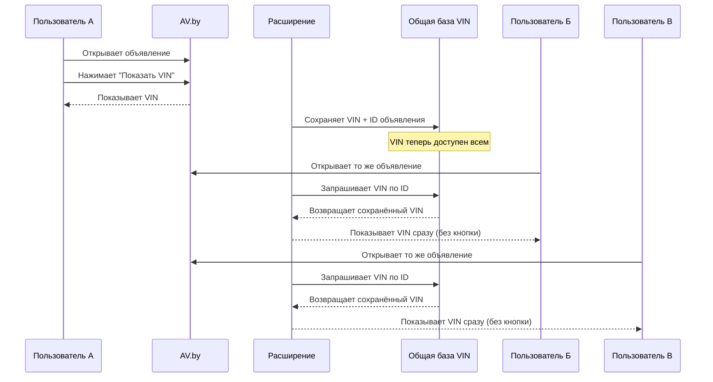

# Логика обмена VIN-кодами между пользователями

## Простой пример

- **Пользователь А** нажимает кнопку "Показать VIN" на сайте — расширение сохраняет его в общую базу.
- **Пользователи Б, В, Г** открывают то же объявление — сразу видят VIN без необходимости нажимать кнопку.

## Зачем это нужно?

На сайте AV.by просмотр VIN-кода работает так:

- **Только зарегистрированные пользователи** могут видеть VIN
- Нужно **нажать кнопку** "Показать VIN" на странице объявления
- **Количество нажатий ограничено** для бесплатных аккаунтов

Расширение позволяет пользователям **делиться VIN-кодами** друг с другом через общую базу данных. Если кто-то уже нажал кнопку — все остальные пользователи расширения увидят этот VIN автоматически.

## Как это работает?

### 1. Сбор VIN-кодов

Когда вы нажимаете кнопку "Показать VIN" на AV.by:

1. Сайт показывает вам VIN-код (тратится один из ваших лимитов просмотров)
2. Расширение автоматически сохраняет VIN в общую базу по ID объявления
3. Теперь любой другой пользователь расширения сразу увидит этот VIN

### 2. Получение VIN-кода

Когда вы заходите на страницу автомобиля:

1. Расширение автоматически проверяет, есть ли VIN в общей базе
2. Если VIN найден — он отображается сразу (вам не нужно тратить свой лимит)
3. Если VIN не найден — вы можете нажать кнопку сами и добавить его в базу

### 3. Подтверждение достоверности

Чтобы убедиться, что VIN-код верный, используется система подтверждений:

- **Каждый пользователь**, который видит VIN, подтверждает его просмотром
- **Каждый пользователь**, который отправляет тот же VIN, подтверждает его записью
- Чем больше подтверждений — тем достовернее информация
- В системе хранится информация о последних 50 пользователях, подтвердивших VIN

### 4. Защита от ошибок

- Если кто-то попробует сохранить **другой VIN** для того же объявления — система откажет в сохранении
- Это защищает от случайных или умышленных ошибок
- VIN можно только подтверждать, но не заменять

## Безопасность и приватность

Личные данные пользователей **надёжно защищены**:

- IP-адрес и данные браузера **не хранятся** в открытом виде
- Для идентификации используется **односторонний хэш SHA-256 с солью**
- Хэш создаётся из: `SHA256(секретная_соль + IP-адрес + User-Agent)`
- Восстановить исходные данные из хэша **невозможно**
- Это позволяет отличать пользователей друг от друга, не зная их реальных данных

## Технические детали (для любопытных)

- Все данные хранятся в облачном хранилище Cloudflare KV
- VIN привязывается к уникальному идентификатору страницы (pageId)
- Каждому VIN можно поставить неограниченное количество подтверждений
- Система хранит только последние 50 уникальных подтверждающих пользователей
- Данные доступны всем пользователям расширения
